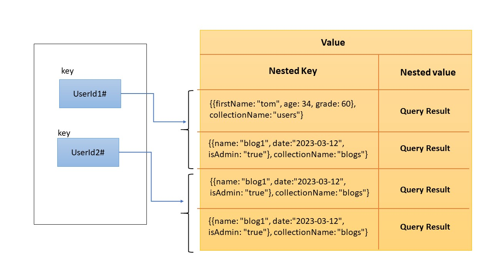

# Data caching with Redis and MongoDB

## Introduction:

In this section we want to create a cache mechanism in Nodejs application written with sailsjs framework.
all developers can use it in their express code too.

Here is the structure of cache service:



# Environment vars

This project uses the following environment variables:

| Name | Description          | Default Value |
| ---- | -------------------- | ------------- |
| CORS | Cors accepted values | "\*"          |

# Pre-requisites

- Install [Node.js](https://nodejs.org/en/) version 8.0.0

# Getting started

- Clone the repository

```
git clone  https://github.com/mahsa70/dataCaching.git
```

- Install dependencies

```
cd dataCaching
npm install
```

- Build and run the project

```
npm start
```

Navigate to `http://localhost:1337`

- API Document endpoints

  swagger Spec Endpoint : http://localhost:1337/dist/

  swagger-ui Endpoint : http://localhost:1337/dist/

### Links

- [Sails framework documentation](https://sailsjs.com/get-started)
- [Version notes / upgrading](https://sailsjs.com/documentation/upgrading)
- [Deployment tips](https://sailsjs.com/documentation/concepts/deployment)
- [Community support options](https://sailsjs.com/support)
- [Professional / enterprise options](https://sailsjs.com/enterprise)

### Version info

This app was originally generated on Fri Apr 08 2023 22:26:09 GMT+0430 (Iran Daylight Time) using Sails v1.4.0.

## Author

- [Mahsa Ghazi](https://github.com/mahsa70)
